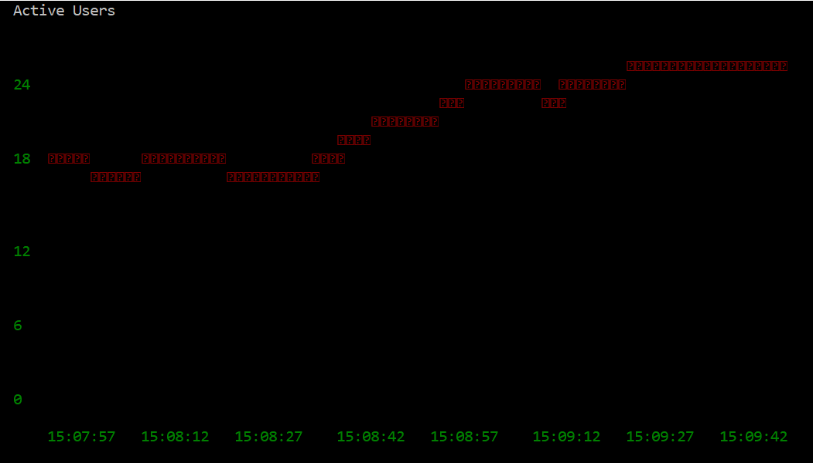
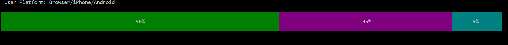
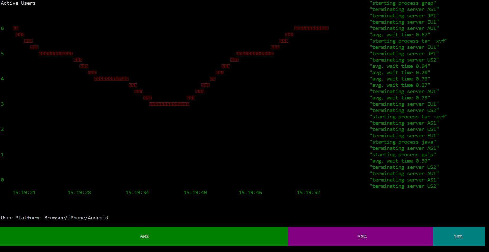

# Realtime Dashboard with Ably

One common requirement when hosting a site these days is to have access to the various statistics associated with it. These can range from how often pages are visited, server status, which regions use your site and when, and so many more. With this data, improving the flow of your site and detecting issues with your design is far easier to do.

However, finding convenient methods of presenting this data can be challenging. If you want to keep an eye on how your site is doing in realtime, you need an efficient method of not only presenting the data, but also communicating it. Ably’s realtime library is ideal for this communication, allowing for data to be transmitted between the server and whatever device you wish to present the data on. 

Throughout this, I will be using node.js, but Ably supports many languages, so it’s no problem to replicate the code in your language of choice. Setting up the transmission of data is simple with Ably. You can easily obtain the Ably Realtime library as an NPM module:

```
npm install ably
```
If you’re not familiar with the basics of Ably, there’s a great tutorial [here](https://www.ably.io/documentation/quick-start-guide).

## Sending messages through Ably

Once you have Ably set up, writing a small script to communicate any information available on your servers through Ably is simple. Without my own server I had to produce some fake data, which would change over time to represent variations you'd see on an actual server. To test the communication, at first I created a file called ‘server.js’, which was to contain the code for publishing messages. I generated my data, and then placed it all into a JSON object, publishing it onto a channel. The rate at which you put out these messages is down to you and your needs, but I settled on 3 seconds.

```
function publishData() {
  getData() 
  channel.publish("ServerData", data);
}
```

**You can view code up to this point  [here](https://github.com/tomczoink/RealtimeDash/commit/df36999788ad1eea950b819cdbd846123a235531).**

## Receiving messages and setting up blessed-contrib

To then receive the data on the client side, I created a script called ‘client.js’. This can listen on the channel on which the server is publishing, and receive the relevant data. Upon receiving the data, you’re free to do what you want with it. 

The [blessed-contrib](https://github.com/yaronn/blessed-contrib) library is a neat tool which allows for an easily edited dashboard in the Command-Line Interface simply with ascii/ansi. It comes with several methods to display data, ranging from graphs to logs, and is very fast to update and re-represent data as it changes. 

For a basic example, I decided to go with making a dashboard capable of presenting the number of active users over time, the proportion of active users on different platforms, and a log from the server. Showing the number of active users over time can be nicely done through a line graph, having the server send the current number intermittently along with a timestamp. Due to each Ably message having a timestamp attached already, you can also do as I did and use that to check the time instead. I then converted the timestamp into the current time of the form HH:MM:SS, and used it for the x-axis on the line graph. 


<a href="url"></a>

**You can view code up to this point [here](https://github.com/tomczoink/RealtimeDash/commit/ab995d71e0ff21a3429691f6fcfdec472a6f465b).**

## More Data!

Now this is done, you can display any data you’d like! In a similar vein to the above example, you can find out what platforms the users of your site tend to be using, which can be very important when it comes to designing and optimizing your site. A pie chart could work quite nicely for displaying the proportion of each platform being used, but in my case I went with the gauge simply out of personal preference.


You'll have already set up your communication system, so as long as you’re wanting the same rate of communication for this data as you did for the active users data, you can just attach any relevant data to the JSON object previously used. This makes it nice and simple on the receiving end to unpack the JSON object and extract all the data you need.

```
data = {"activeUsers" : + activeUsers, 
        "browserUsers": + browserUsers,
        "iPhoneUsers" : + iPhoneUsers,
        "androidUsers": + androidUsers
};
```

With the relevant data, you can now easily construct a gauge through blessed-contrib. Due to wanting two graphs however, you’ll now need to specify a grid format to structure these graphics. Thankfully with blessed-contrib this is a simple task, requiring you to replace:

```
var gauge = contrib.gauge({...})
```

And make use of this instead:

```
var gauge = grid.set(0, 0, 4, 4, contrib.gauge, {...})
```

Where the first two 0s represent where the gauge will start in respect to the row and column on the grid, and the two 4s represent the height and width.

<a href="url"></a>

**You can view code up to this point [here](https://github.com/tomczoink/RealtimeDash/commit/d6063ff9a0fbdcbeb553c78433b26028c295a460).**

## Separate messages and a Server Log

As the final component to my dashboard, I wanted to produce a server log. However, I'd need the server to send me log updates as and when they occur, rather than at the predictable rate of the two previous examples. With Ably being able to send different forms of message, this is very simple, allowing use of the same channel to send the data.

By implementing a new function for publishing data from the server, you simply need to publish your new message with a different name for it to be easily distinguished from any other messages on the channel. With a quick check by the client, it's now a simple matter of interpreting the contents of the message as intended.

```
channel.subscribe(function(msg) {
  if (msg.name == "ServerData") {
    //Code reacting appropriately
  } else if (msg.name == "ServerLog") {
    //Code dealing with log data
  }
```

From here you can have your server log sent to your client as often as you like, keeping you up to date on your server status. blessed-contrib comes with a system for logging, so you can just throw that into your grid view, mess around a bit with the layout, and get a wonderful dashboard in your Command-Line Interface!

<a href="url"></a>

**The full project can be found [here](https://github.com/tomczoink/RealtimeDash/commits/dashboard-nodejs)**
